```mermaid
flowchart LR
 subgraph subGraph0["User Layer"]
        User["👤 User/Customer"]
  end
 subgraph subGraph1["API Layer"]
        Auth["🔐 JWT Authentication"]
        API["⚡ FastAPI Backend"]
  end
 subgraph subGraph2["Agent Tools"]
        TextSearch["🔍 Text Search Tool"]
        VisualSearch["🖼️ Visual Search Tool"]
        OrderTool["📦 Order Details Tool"]
  end
 subgraph subGraph3["AI Agent Layer"]
        Orchestrator["🧠 LangChain Orchestrator<br>GPT-4-mini"]
        subGraph2
  end
 subgraph subGraph4["ML Models"]
        CLIP["🎨 CLIP ViT-B-32<br>512D Image Embeddings"]
  end
 subgraph subGraph5["Data Storage"]
        ChromaDB[("🗄️ ChromaDB<br>Vector Store")]
        SQLite[("💾 SQLite<br>Users &amp; Conversations")]
        GCS[("☁️ Google Cloud Storage<br>Images")]
  end
    User -- Chat Message/Image --> Auth
    Auth -- Validate Token --> API
    API -- Route Request --> Orchestrator
    Orchestrator -- Analyze Intent --> TextSearch & VisualSearch & OrderTool
    TextSearch -- Generate Embedding --> SentenceTransformer
    VisualSearch -- Generate Embedding --> CLIP
    SentenceTransformer -- Query Vectors --> ChromaDB
    CLIP -- Query Vectors --> ChromaDB
    ChromaDB -- Similar Products --> Orchestrator
    SQLite -- Conversation History --> API
    GCS -- Image URLs --> VisualSearch
    Orchestrator -- Format Response --> API
    API -- Product Results --> User
    API -- Save Conversation --> SQLite

    style User fill:#E1BEE7
    style Auth fill:#FFCDD2
    style API fill:#BBDEFB
    style Orchestrator fill:#C8E6C9
    style TextSearch fill:#FFF9C4
    style VisualSearch fill:#F8BBD0
    style OrderTool fill:#B2DFDB
    style SentenceTransformer fill:#D1C4E9
    style CLIP fill:#FFCCBC
    style ChromaDB fill:#FFE0B2
    style SQLite fill:#B2EBF2
    style GCS fill:#C5E1A5
```

config:
      theme: redux-dark-color
``
flowchart LR
 subgraph subGraph0["User Layer"]
        User["👤 User/Customer"]
  end
 subgraph subGraph1["API Layer"]
        Auth["🔐 JWT Authentication"]
        API["⚡ FastAPI Backend"]
  end
 subgraph subGraph2["Agent Tools"]
        TextSearch["🔍 Text Search Tool"]
        VisualSearch["🖼️ Visual Search Tool"]
        OrderTool["📦 Order Details Tool"]
  end
 subgraph subGraph3["AI Agent Layer"]
        Orchestrator["🧠 LangChain Orchestrator<br>GPT-4-mini"]
        subGraph2
  end
 subgraph subGraph4["ML Models"]
        CLIP["🎨 CLIP ViT-B-32<br>512D Image Embeddings"]
  end
 subgraph subGraph5["Data Storage"]
        ChromaDB[("🗄️ ChromaDB<br>Vector Store")]
        SQLite[("💾 SQLite<br>Users &amp; Conversations")]
        GCS[("☁️ Google Cloud Storage<br>Images")]
  end
    User -- Chat Message/Image --> Auth
    Auth -- Validate Token --> API
    API -- Route Request --> Orchestrator
    Orchestrator -- Analyze Intent --> TextSearch & VisualSearch & OrderTool
    TextSearch -- Generate Embedding --> SentenceTransformer
    VisualSearch -- Generate Embedding --> CLIP
    SentenceTransformer -- Query Vectors --> ChromaDB
    CLIP -- Query Vectors --> ChromaDB
    ChromaDB -- Similar Products --> Orchestrator
    SQLite -- Conversation History --> API
    GCS -- Image URLs --> VisualSearch
    Orchestrator -- Format Response --> API
    API -- Product Results --> User
    API -- Save Conversation --> SQLite

    style User fill:#E1BEE7
    style Auth fill:#FFCDD2
    style API fill:#BBDEFB
    style Orchestrator fill:#C8E6C9
    style TextSearch fill:#FFF9C4
    style VisualSearch fill:#F8BBD0
    style OrderTool fill:#B2DFDB
    style SentenceTransformer fill:#D1C4E9
    style CLIP fill:#FFCCBC
    style ChromaDB fill:#FFE0B2
    style SQLite fill:#B2EBF2
    style GCS fill:#C5E1A5
```
config:
      theme: redux-dark-color
`
flowchart LR
 subgraph subGraph0["User Layer"]
        User["👤 User/Customer"]
  end
 subgraph subGraph1["API Layer"]
        Auth["🔐 JWT Authentication"]
        API["⚡ FastAPI Backend"]
  end
 subgraph subGraph2["Agent Tools"]
        TextSearch["🔍 Text Search Tool"]
        VisualSearch["🖼️ Visual Search Tool"]
        OrderTool["📦 Order Details Tool"]
  end
 subgraph subGraph3["AI Agent Layer"]
        Orchestrator["🧠 LangChain Orchestrator<br>GPT-4-mini"]
        subGraph2
  end
 subgraph subGraph4["ML Models"]
        CLIP["🎨 CLIP ViT-B-32<br>512D Image Embeddings"]
  end
 subgraph subGraph5["Data Storage"]
        ChromaDB[("🗄️ ChromaDB<br>Vector Store")]
        SQLite[("💾 SQLite<br>Users &amp; Conversations")]
        GCS[("☁️ Google Cloud Storage<br>Images")]
  end
    User -- Chat Message/Image --> Auth
    Auth -- Validate Token --> API
    API -- Route Request --> Orchestrator
    Orchestrator -- Analyze Intent --> TextSearch & VisualSearch & OrderTool
    TextSearch -- Generate Embedding --> SentenceTransformer
    VisualSearch -- Generate Embedding --> CLIP
    SentenceTransformer -- Query Vectors --> ChromaDB
    CLIP -- Query Vectors --> ChromaDB
    ChromaDB -- Similar Products --> Orchestrator
    SQLite -- Conversation History --> API
    GCS -- Image URLs --> VisualSearch
    Orchestrator -- Format Response --> API
    API -- Product Results --> User
    API -- Save Conversation --> SQLite

    style User fill:#E1BEE7
    style Auth fill:#FFCDD2
    style API fill:#BBDEFB
    style Orchestrator fill:#C8E6C9
    style TextSearch fill:#FFF9C4
    style VisualSearch fill:#F8BBD0
    style OrderTool fill:#B2DFDB
    style SentenceTransformer fill:#D1C4E9
    style CLIP fill:#FFCCBC
    style ChromaDB fill:#FFE0B2
    style SQLite fill:#B2EBF2
    style GCS fill:#C5E1A5
```
config:
      theme: redux-dark-color

flowchart LR
 subgraph subGraph0["User Layer"]
        User["👤 User/Customer"]
  end
 subgraph subGraph1["API Layer"]
        Auth["🔐 JWT Authentication"]
        API["⚡ FastAPI Backend"]
  end
 subgraph subGraph2["Agent Tools"]
        TextSearch["🔍 Text Search Tool"]
        VisualSearch["🖼️ Visual Search Tool"]
        OrderTool["📦 Order Details Tool"]
  end
 subgraph subGraph3["AI Agent Layer"]
        Orchestrator["🧠 LangChain Orchestrator<br>GPT-4-mini"]
        subGraph2
  end
 subgraph subGraph4["ML Models"]
        CLIP["🎨 CLIP ViT-B-32<br>512D Image Embeddings"]
  end
 subgraph subGraph5["Data Storage"]
        ChromaDB[("🗄️ ChromaDB<br>Vector Store")]
        SQLite[("💾 SQLite<br>Users &amp; Conversations")]
        GCS[("☁️ Google Cloud Storage<br>Images")]
  end
    User -- Chat Message/Image --> Auth
    Auth -- Validate Token --> API
    API -- Route Request --> Orchestrator
    Orchestrator -- Analyze Intent --> TextSearch & VisualSearch & OrderTool
    TextSearch -- Generate Embedding --> SentenceTransformer
    VisualSearch -- Generate Embedding --> CLIP
    SentenceTransformer -- Query Vectors --> ChromaDB
    CLIP -- Query Vectors --> ChromaDB
    ChromaDB -- Similar Products --> Orchestrator
    SQLite -- Conversation History --> API
    GCS -- Image URLs --> VisualSearch
    Orchestrator -- Format Response --> API
    API -- Product Results --> User
    API -- Save Conversation --> SQLite

    style User fill:#E1BEE7
    style Auth fill:#FFCDD2
    style API fill:#BBDEFB
    style Orchestrator fill:#C8E6C9
    style TextSearch fill:#FFF9C4
    style VisualSearch fill:#F8BBD0
    style OrderTool fill:#B2DFDB
    style SentenceTransformer fill:#D1C4E9
    style CLIP fill:#FFCCBC
    style ChromaDB fill:#FFE0B2
    style SQLite fill:#B2EBF2
    style GCS fill:#C5E1A5
```
config:
      theme: redux-dark-color
      
flowchart LR
 subgraph subGraph0["User Layer"]
        User["👤 User/Customer"]
  end
 subgraph subGraph1["API Layer"]
        Auth["🔐 JWT Authentication"]
        API["⚡ FastAPI Backend"]
  end
 subgraph subGraph2["Agent Tools"]
        TextSearch["🔍 Text Search Tool"]
        VisualSearch["🖼️ Visual Search Tool"]
        OrderTool["📦 Order Details Tool"]
  end
 subgraph subGraph3["AI Agent Layer"]
        Orchestrator["🧠 LangChain Orchestrator<br>GPT-4-mini"]
        subGraph2
  end
 subgraph subGraph4["ML Models"]
        CLIP["🎨 CLIP ViT-B-32<br>512D Image Embeddings"]
  end
 subgraph subGraph5["Data Storage"]
        ChromaDB[("🗄️ ChromaDB<br>Vector Store")]
        SQLite[("💾 SQLite<br>Users &amp; Conversations")]
        GCS[("☁️ Google Cloud Storage<br>Images")]
  end
    User -- Chat Message/Image --> Auth
    Auth -- Validate Token --> API
    API -- Route Request --> Orchestrator
    Orchestrator -- Analyze Intent --> TextSearch & VisualSearch & OrderTool
    TextSearch -- Generate Embedding --> SentenceTransformer
    VisualSearch -- Generate Embedding --> CLIP
    SentenceTransformer -- Query Vectors --> ChromaDB
    CLIP -- Query Vectors --> ChromaDB
    ChromaDB -- Similar Products --> Orchestrator
    SQLite -- Conversation History --> API
    GCS -- Image URLs --> VisualSearch
    Orchestrator -- Format Response --> API
    API -- Product Results --> User
    API -- Save Conversation --> SQLite

    style User fill:#E1BEE7
    style Auth fill:#FFCDD2
    style API fill:#BBDEFB
    style Orchestrator fill:#C8E6C9
    style TextSearch fill:#FFF9C4
    style VisualSearch fill:#F8BBD0
    style OrderTool fill:#B2DFDB
    style SentenceTransformer fill:#D1C4E9
    style CLIP fill:#FFCCBC
    style ChromaDB fill:#FFE0B2
    style SQLite fill:#B2EBF2
    style GCS fill:#C5E1A5
```
config:
      theme: redux-dark-color
flowchart LR
 subgraph subGraph0["User Layer"]
        User["👤 User/Customer"]
  end
 subgraph subGraph1["API Layer"]
        Auth["🔐 JWT Authentication"]
        API["⚡ FastAPI Backend"]
  end
 subgraph subGraph2["Agent Tools"]
        TextSearch["🔍 Text Search Tool"]
        VisualSearch["🖼️ Visual Search Tool"]
        OrderTool["📦 Order Details Tool"]
  end
 subgraph subGraph3["AI Agent Layer"]
        Orchestrator["🧠 LangChain Orchestrator<br>GPT-4-mini"]
        subGraph2
  end
 subgraph subGraph4["ML Models"]
        CLIP["🎨 CLIP ViT-B-32<br>512D Image Embeddings"]
  end
 subgraph subGraph5["Data Storage"]
        ChromaDB[("🗄️ ChromaDB<br>Vector Store")]
        SQLite[("💾 SQLite<br>Users &amp; Conversations")]
        GCS[("☁️ Google Cloud Storage<br>Images")]
  end
    User -- Chat Message/Image --> Auth
    Auth -- Validate Token --> API
    API -- Route Request --> Orchestrator
    Orchestrator -- Analyze Intent --> TextSearch & VisualSearch & OrderTool
    TextSearch -- Generate Embedding --> SentenceTransformer
    VisualSearch -- Generate Embedding --> CLIP
    SentenceTransformer -- Query Vectors --> ChromaDB
    CLIP -- Query Vectors --> ChromaDB
    ChromaDB -- Similar Products --> Orchestrator
    SQLite -- Conversation History --> API
    GCS -- Image URLs --> VisualSearch
    Orchestrator -- Format Response --> API
    API -- Product Results --> User
    API -- Save Conversation --> SQLite

    style User fill:#E1BEE7
    style Auth fill:#FFCDD2
    style API fill:#BBDEFB
    style Orchestrator fill:#C8E6C9
    style TextSearch fill:#FFF9C4
    style VisualSearch fill:#F8BBD0
    style OrderTool fill:#B2DFDB
    style SentenceTransformer fill:#D1C4E9
    style CLIP fill:#FFCCBC
    style ChromaDB fill:#FFE0B2
    style SQLite fill:#B2EBF2
    style GCS fill:#C5E1A5
```